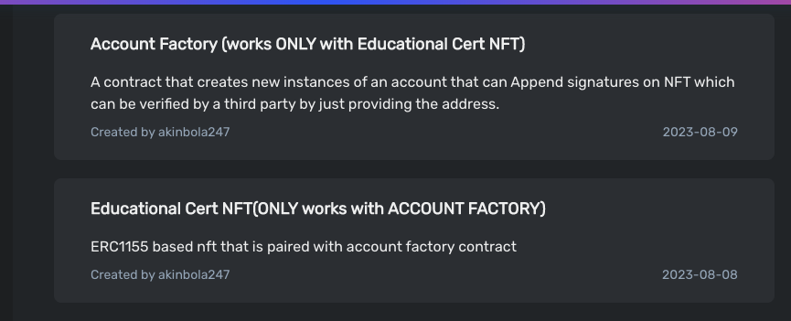

# EduCert - Redefining Certification Management with Celo Composer and Bunzz

## Introduction
EduCert is an innovative certification management platform that revolutionizes how organizations issue, manage, and verify certifications. By seamlessly integrating Celo Composer, EIP712, and ERC1155 standards and deploying on celo alfajores through bunzz, EduCert provides a secure, transparent, and user-friendly solution for certification processes. This readme provides an overview of EduCert's key components, features, and benefits.
### **Links:**
- Pitch youtube Link : https://youtu.be/RXf3cWwMfCw
- Website Deployment address : https://educert.vercel.app/
- Deployed Factory contract handling Accounts : https://alfajores.celoscan.io/address/0x504195e2a73A2Cd0f3c691e49ADC93E509cFdA79
- Deployed ERC1155 contract : https://alfajores.celoscan.io/address/0x225eDb9c4F9B58Cb257C31A50f56e3de882a420c
- A deployed UserAccount Contract deployed from factory : https://alfajores.celoscan.io/address/0xf2c15326f35b1fbe7524806d9c3ff4809421b389
- Image of contract upload and deployment on Bunzz: 
- 

## Clone

To get started with Certificate Verifier, you can clone the repository using the following command:
```bash
git clone https://github.com/Akinbola247/Certificate-Verifier.git

npm install or yarn install 
cd packages
cd react-app
npm run dev

```

## Key Components

1. **Celo Composer Integration**
   EduCert leverages the power of Celo Composer for simplified smart contract development and frontend integration through the inherent hardhat and react-app inclusion. This integration accelerates the creation of customized smart contracts along side it's frontend integration.

2. **Bunzz**
    After smart contract development and testing, the project was uploaded and deployed to Celo Alfajores Testnet through the bunzz platform.

3. **EIP712 for Offchain Signature Computation / Onchain Verification**
   The platform ensures certification integrity and security through EIP712. Offchain signature computation facilitates secure digital signing, while onchain verification enhances trust and authenticity on the blockchain.

4. **ERC1155 for Proof of Certification**
   Certifications issued via EduCert are represented as ERC1155 tokens. Each token includes cryptographic signatures, and other relevant data, streamlining certification management and verification.

## Features and Functionality

- **Account Management**
  EduCert provides an intuitive account creation and management system. Organizations can effortlessly create accounts, oversee certification processes, and monitor progress, ensuring a smooth user experience.

- **Certification Issuance**
  Organizations can issue certifications seamlessly through EduCert. Certifications are appended with cryptographic signatures, assuring recipients or verifier of their authenticity and source.

- **Signature Verification**
  EduCert simplifies signature verification, enabling recipients, employers, and other stakeholders to validate appended signatures and enhance transparency and trust.

- **Deployment on Celo Alfajores Testnet through bunzz**
  EduCert is deployed on the Celo Alfajores Testnet through bunzz platform, providing a secure environment for certificate issuance and verification

## Benefits

- **Efficiency**
  EduCert streamlines certification issuance with its simplified smart contract development and issuance processes, saving time and resources.

- **Security**
  EIP712 and onchain verification ensure certifications are tamper-proof and digitally secure, maintaining the credibility of issued certifications.

- **Transparency**
  ERC1155 tokens enhance transparency and accessibility during the verification process, fostering trust within the certification ecosystem.

- **User Empowerment**
  EduCert empowers issuers and recipients with an intuitive platform for certification issuance, management, and verification, promoting ownership and accountability.

## Conclusion
EduCert reimagines certification management by combining Celo Composer, Bunzz, EIP712, and ERC1155 standards. With its user-centric approach, robust security measures, and streamlined processes, EduCert enables organizations to issue, manage, and verify certifications efficiently and confidently. Deployed on the Celo Alfajores Testnet, EduCert is poised to reshape the certification landscape and establish a new standard for transparency and credibility.
